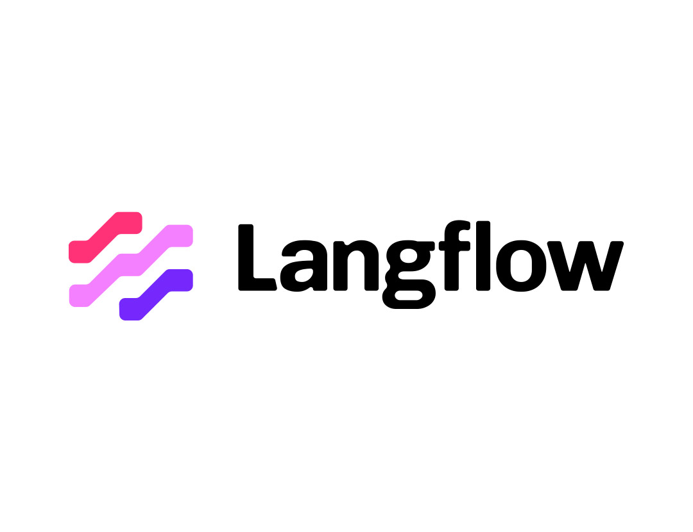

# Manual de Instalação

Este documento visa fornecer um guia com todos os procedimentos necessários para a execução do projeto final numa máquina local.

## Tabela de Contéudos

- Instalações e dependências necessárias
- Configurações de ambiente necessárias
- Acesso ao código fonte do projeto
- Execução da interface gráfica
- Execução do serviço de API
- Execução do micro-serviço do Langflow

## Instalações e depêndencias necessárias

### Node.js 22.17.0

O Node.js é essencial para executar este projeto. Faça o download da versão LTS (Long Term Support) mais recente:

[Download do NodeJS para Windows ou MacOS](https://nodejs.org/pt/download)

**Versão recomendada: 22.17.0**

### Docker Desktop

O Docker Desktop é necessário para executar o rabbitmq. Faça download da versão mais recente:

[Download para Windows](https://docs.docker.com/desktop/setup/install/windows-install)

[Download para MacOS](https://docs.docker.com/desktop/setup/install/mac-install/)

[Download para Linux](https://docs.docker.com/desktop/setup/install/linux/)

### Langflow Desktop

O Langflow é a plataforma utilizada para a criação e gestão de agentes AI, é necessário para a execução do projeto. Faça download da versão mais recente:

[Download para Windows ou MacOS](https://www.langflow.org/desktop)

**Nota: Certifique-se que todas estas dependências estão corretamente instaladas antes de avançar para o próximo passo**
